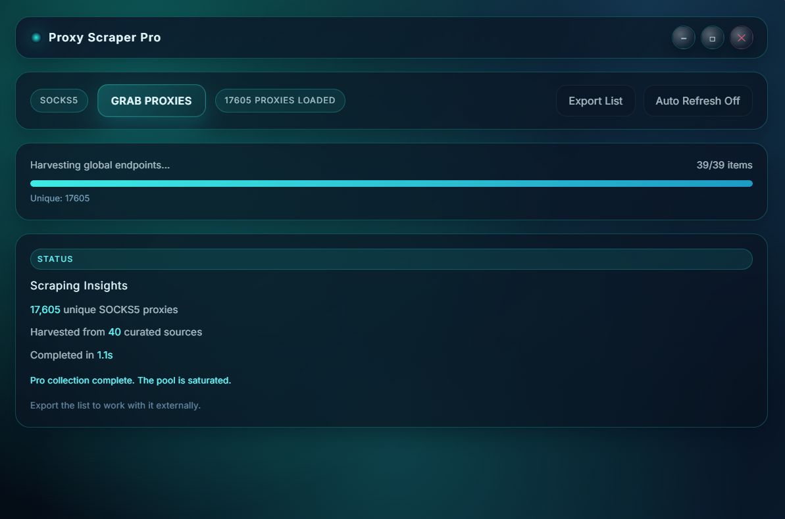

# Proxy Scraper Pro

Desktop SOCKS5 proxy harvester with a neon-glass UI, built on Electron.  
The app fans out across dozens of curated sources, deduplicates results in-memory, and gives you a one-click export of the freshest endpoints for testing or automation flows.

## ✨ Features

- **Mass collection engine** – concurrently scrapes 50+ open proxy feeds plus the Geonode API, auto-deduping results.
- **Real-time telemetry** – glassmorphic dashboard with progress, totals, and scrape duration at a glance.
- **Safe-by-default** – renderer runs with `contextIsolation` and no `nodeIntegration`.
- **One-click export** – instantly save the latest sweep to a newline-delimited `.txt` file.
- **Auto refresh cadence** – optional background job to rerun the scrape every 30 minutes.
- **Installer-ready build** – packaged via `electron-builder` for signed Windows installers.

 

## 🚀 Getting Started

### Prerequisites

- Node.js 18.x or newer (comes with `npm`)
- Windows for packaged build output (dev server runs cross-platform)

### Installation

```bash
npm install
```

### Development Run

```bash
npm run dev
```

This starts Electron with dev tools enabled (`--dev` flag) so you can inspect the renderer.

### Production Build

```bash
npm run build
```

Outputs appear in `dist/`:

- `dist/win-unpacked/` – portable build for quick verification
- `dist/Proxy Scraper Pro Setup <version>.exe` – NSIS installer with shortcuts and icon set

## 🧭 Usage

1. Launch the app and press **Grab Proxies** to start the sweep.
2. Watch progress metrics update live; totals and timing land in the **Scraping Insights** panel.
3. Optionally enable **Auto Refresh** to rerun the sweep every 30 minutes.
4. Hit **Export List** to download the current pool as `socks5_proxies_max_<date>.txt`.

Exports always reflect the most recent scrape, even if the UI has been closed and reopened before exporting.

## 🛠 Tech Stack

- [Electron](https://electronjs.org/) (main + renderer)
- [Axios](https://axios-http.com/) for HTTP requests
- Tailwind-driven styling with custom CSS for the neon/glass aesthetic

## 📁 Project Structure

```
├── main.js          # Electron main process & scrape coordinator
├── preload.js       # Safe bridge exposing IPC helpers
├── renderer.js      # Renderer logic (progress, export, auto-refresh)
├── index.html       # Neon glass UI shell
├── styles.css       # Custom theme tokens & component styles
├── icons/           # App icon assets (PNG + ICO for installers)
└── package.json     # Scripts, metadata, and electron-builder config
```

## 🤝 Contributing

Pull requests are welcome! For larger changes, open an issue outlining the idea so we can align on UX and scope.

## 📄 License

This project is released under the [MIT License](LICENSE) unless you choose a different license.
